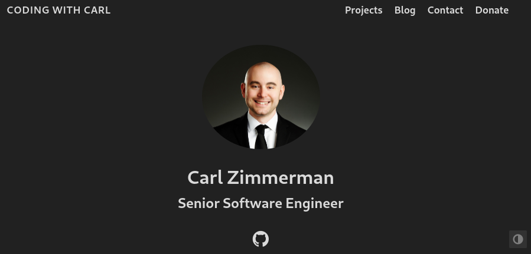

<!-- HEADER -->
 

    

  <h3 align="center">Coding With Carl</h3>

  

    Assets for codingwithcarl.com
     
    <a href="https://codingwithcarl.com"><strong>View Demo »</strong></a>
     
     
  

<!-- ABOUT -->
## About

Assets for codingwithcarl.com generated by using Hugo and the Coder theme.

### Built With

* [Hugo](https://gohugo.io/)
* [Hugo-Coder](https://github.com/luizdepra/hugo-coder)

<!-- CONTRIBUTING -->
## Contributing

As this is for my personal blog, contributions are not necessary. However, if you would like to contribute a guest article, feel free to email me at codingwithcarl@outlook.com

<!-- LICENSE -->
## License

Distributed under the GPLv3 License. See `LICENSE` for more information.

(<a href="#top">back to top</a>)
